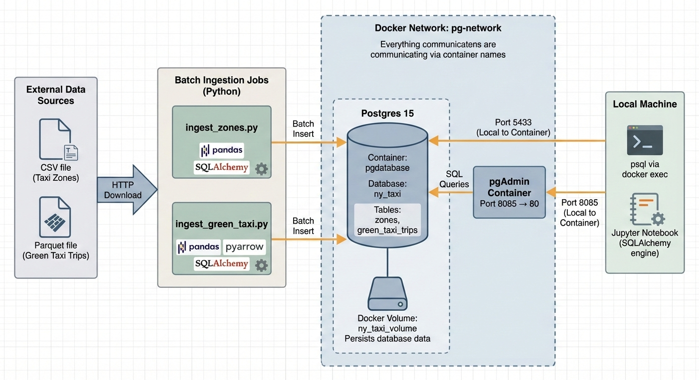

# Module 1 Homework: Docker & SQL

This repository contains my solution for **Module 1 Homework** from the Data Engineering Zoomcamp.  
The homework focuses on **Docker, SQL, and Terraform**, covering environment setup, data ingestion, querying, and GCP infrastructure provisioning.

---

## Table of Contents

- [Docker](#docker)
- [Prepare the Data](#prepare-the-data)
- [SQL Queries](#sql-queries)
- [Terraform](#terraform)
- [Useful Links](#useful-links)

---

## Docker
### Question 1: Understanding Docker images

Run a Python container using:

```bash
docker run -it --rm --entrypoint=bash python:3.13
```

Check the pip version:
```
pip --version
```
#### Answer: 25.3

---

### Question 2: Docker Networking & Docker Compose

Given the docker-compose.yaml:
```
services:
  db:
    container_name: postgres
    image: postgres:17-alpine
    environment:
      POSTGRES_USER: 'postgres'
      POSTGRES_PASSWORD: 'postgres'
      POSTGRES_DB: 'ny_taxi'
    ports:
      - '5433:5432'
    volumes:
      - vol-pgdata:/var/lib/postgresql/data
```
Since pgAdmin and Postgres are on the same Docker network, containers communicate using the service name and the internal container port.

Hostname: db

Port: 5432

The host mapping 5433:5432 is only for host-to-container access and does not apply to container-to-container communication.

#### Answer: db:5432
---
### Prepare the Data
Download taxi trips data for November 2025:

wget https://d37ci6vzurychx.cloudfront.net/trip-data/green_tripdata_2025-11.parquet

Download the NYC taxi zones dataset:


wget https://github.com/DataTalksClub/nyc-tlc-data/releases/download/misc/taxi_zone_lookup.csv

#### My Data Architechture

```
- Set up Python environment and install required packages for ingestion.

- Created a Docker network for container communication.

- Tested database connection in Jupyter Notebook.

- Created Python scripts for ingestion of data files.
```
---

### SQL Queries
### Question 3: Counting short trips
```
SELECT 
    COUNT(*) AS Trips_less_1mile
FROM green_taxi_trips
WHERE lpep_pickup_datetime >= '2025-11-01' 
  AND lpep_pickup_datetime < '2025-12-01'
  AND trip_distance <= 1;
```
#### Answer: 8007
---
### Question 4: Longest trip for each day
```
SELECT 
    pickup_date
FROM
    (SELECT
         DATE(lpep_pickup_datetime) AS pickup_date,
         SUM(trip_distance) AS TotalDist
     FROM green_taxi_trips
     WHERE trip_distance < 100
     GROUP BY DATE(lpep_pickup_datetime)
     ORDER BY SUM(trip_distance) DESC) AS T
LIMIT 1;
```
#### Answer: 2025-11-20
---
### Question 5: Biggest pickup zone
```
SELECT 
    Z."Zone",
    SUM(G.total_amount) AS SumofMoneyPaid
FROM green_taxi_trips AS G
JOIN zones Z ON G."PULocationID" = Z."LocationID"
WHERE DATE(lpep_pickup_datetime) = '2025-11-18'
GROUP BY Z."Zone"
ORDER BY SumofMoneyPaid DESC;
```
#### Answer: East Harlem North
---
### Question 6: Largest tip
```
SELECT 
    Z2."Zone" AS pickup_zone,
    Z1."Zone" AS dropoff_zone,
    G.tip_amount AS Tips
FROM green_taxi_trips AS G
JOIN zones Z1 ON G."DOLocationID" = Z1."LocationID"
JOIN zones Z2 ON G."PULocationID" = Z2."LocationID"
WHERE (G.lpep_pickup_datetime >= '2025-11-01' AND G.lpep_pickup_datetime < '2025-12-01') 
  AND Z2."Zone" = 'East Harlem North'
ORDER BY Tips DESC
LIMIT 1;
```
### Answer: Yorkville West
---
## Terraform
In this section homework we'll prepare the environment by creating resources in GCP with Terraform.

In your VM on GCP/Laptop/GitHub Codespace install Terraform. Copy the files from the course repo [here](https://github.com/DataTalksClub/data-engineering-zoomcamp/tree/main/01-docker-terraform/terraform/terraform)
 to your VM/Laptop/GitHub Codespace.

Modify the files as necessary to create a GCP Bucket and Big Query Dataset.
Setup
```
- Created the following Terraform files: 
    - main.tf 
    - variables.tf
    - outputs.tf
    - terraform.tfvars

- Added access controls in GCP project

- Used Terraform commands:
    - terraform init
    - terraform plan
    - terraform apply
```
---
### Question 7: Terraform Workflow
```
Workflow sequence for Terraform:

Download provider plugins & set up backend: terraform init

Generate proposed changes & auto-apply plan: terraform apply -auto-approve

Remove all resources managed by Terraform: terraform destroy
```
#### Answer: terraform init, terraform apply -auto-approve, terraform destroy
---

## Note about omitted files

Some Terraform files and folders have **not been added to this repository** because they are too large for GitHub:

- `.terraform/` folder (Terraform provider binaries)
- `terraform.tfstate` and `terraform.tfstate.backup` (state files)
- `.terraform.lock.hcl` (lock file)
- `.venv/`

To run this project after cloning:

1. Create a Python virtual environment: `python -m venv .venv`
2. Activate it: `.venv\Scripts\activate` (Windows) or `source .venv/bin/activate` (Linux/Mac)
3. Install dependencies: `pip install -r requirements.txt` (if you have any)
4. Initialize Terraform: `terraform init`
---

### Terraform & BigQuery Resources

- **google_bigquery_dataset**  
  Terraform resource for managing BigQuery datasets  
  https://registry.terraform.io/providers/hashicorp/google/latest/docs/resources/bigquery_dataset

- **terraform-google bigquery module**  
  Community-supported Terraform module for provisioning BigQuery resources  
  https://registry.terraform.io/modules/terraform-google-modules/bigquery/google/latest

- **bigquery-terraform-module (Google Blog)**  
  Official Google Cloud blog introducing the BigQuery Terraform module  
  https://cloud.google.com/blog/products/data-analytics/introducing-the-bigquery-terraform-module

- **google_storage_bucket**  
  Terraform resource for managing Google Cloud Storage buckets  
  https://registry.terraform.io/providers/hashicorp/google/4.35.0/docs/resources/storage_bucket
